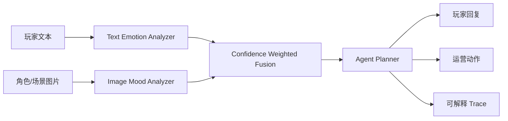

# Anime Mood Agent Studio

面向二次元手游场景的多模态情绪感知 Agent 项目。它可以同时读取玩家文本反馈和角色/场景图片，融合情绪状态，再生成角色化回复、运营风险等级、后续处理动作和可解释 agent trace。

这个项目定位为人工智能/游戏算法实习作品集：重点不是堆一个聊天壳，而是把“多模态情感识别、可解释融合、agent 决策、Web 部署、测试与 CI”串成一条完整工程链路。

## 应用场景

- 玩家反馈分析：识别卡池焦虑、付费不满、剧情期待、正向反馈等运营意图。
- 舆情分级：结合情绪效价、唤醒度和关键词，给出 low / medium / high 风险。
- NPC/客服回复：根据“温柔治愈、冷静策士、元气伙伴”三类人设生成不同策略的回复。
- 美术/剧情验证：上传角色立绘或活动图，评估画面氛围是否和文本反馈一致。

## 核心能力



### 1. 文本情绪识别

- 支持中英情绪词、否定词、强度词、标点和 emoji。
- 输出 Plutchik 风格情绪分布：joy、sadness、anger、fear、trust、surprise、anticipation、disgust、neutral。
- 输出效价 valence、唤醒度 arousal、置信度 confidence 和命中证据。

### 2. 图像情绪识别

- 使用 Pillow 提取亮度、饱和度、对比度、冷暖色比例、红色占比、暗部比例、边缘密度。
- 将画面氛围映射为情绪分布，用于二次元角色立绘、活动图、战斗截图等场景。
- 不依赖云端模型，适合本地演示、课堂答辩和离线部署。

### 3. 多模态融合

- 文本和图像按置信度加权融合。
- 当文本和图像效价冲突时，会在 explanation 中提示“语义和画面氛围存在反差”。
- 输出统一情绪状态，供 agent 决策使用。

### 4. Agent 决策

Agent 不是单轮模板，而是显式执行五步：

1. `detect_intent`：识别玩家意图。
2. `assess_emotion`：读取融合情绪状态。
3. `rank_liveops_risk`：评估运营/舆情风险。
4. `select_response_style`：按人设选择回复策略。
5. `draft_action_plan`：生成玩家回复、运营动作和剧情钩子。

## 快速开始

```bash
python3 -m venv .venv
. .venv/bin/activate
pip install -e ".[dev]"
uvicorn app.main:app --host 0.0.0.0 --port 8000
```

打开浏览器访问：

```text
http://localhost:8000
```

API 文档：

```text
http://localhost:8000/docs
```

## Docker 部署

```bash
docker compose up --build
```

服务启动后访问：

```text
http://localhost:8000
```

## 测试

```bash
pytest
```

测试覆盖：

- 文本情绪识别和否定词处理。
- 红色高饱和图像的愤怒/高唤醒识别。
- 文本+图像融合。
- `/api/health` 和 `/api/analyze` 接口。

## API 示例

```bash
curl -X POST http://localhost:8000/api/analyze \
  -F "text=这次礼包说明太离谱了，感觉有点骗氪，再这样我要退坑了！" \
  -F "archetype=冷静策士"
```

返回结构包含：

- `text`：文本情绪信号。
- `image`：图像情绪信号，没有图片时为 `null`。
- `fusion`：融合后的主情绪、效价、唤醒度、置信度。
- `agent`：意图、风险等级、回复策略、玩家回复、运营动作和 trace。

## 项目结构

```text
.
├── app
│   ├── core
│   │   ├── agent.py
│   │   ├── fusion.py
│   │   ├── image_emotion.py
│   │   ├── schemas.py
│   │   └── text_emotion.py
│   ├── main.py
│   └── static
│       ├── app.js
│       ├── index.html
│       └── styles.css
├── tests
├── Dockerfile
├── docker-compose.yml
├── pyproject.toml
└── README.md
```

## 面试讲法

可以把这个项目概括为：

> 我做了一个面向二次元手游运营和剧情反馈的多模态情绪感知 Agent。系统用文本情绪识别和图像氛围分析生成两个模态的情绪分布，再通过置信度加权融合成统一玩家状态。Agent 根据情绪状态和意图识别结果，生成风险分级、角色化回复、运营动作和可解释 trace。项目提供 FastAPI 服务、原生 Web 前端、Docker 部署和自动化测试。

可以重点展开三个技术点：

- 为什么要做多模态：玩家文本可能很短，但截图/立绘/战斗场景能补充氛围信息。
- 为什么要可解释：游戏运营和剧情团队需要知道判断依据，不能只给一个黑盒标签。
- 为什么适合 agent：agent 不只是聊天，而是把识别、分级、策略选择和行动建议组织成可追踪流程。

## 后续可扩展方向

- 接入 CLIP / SigLIP 做图文语义对齐。
- 接入中文情绪分类模型替换词典 baseline。
- 增加玩家反馈聚类和版本情绪趋势看板。
- 加入 RAG：把公告、补偿规则、卡池说明作为知识库，生成更准确的客服回复。

