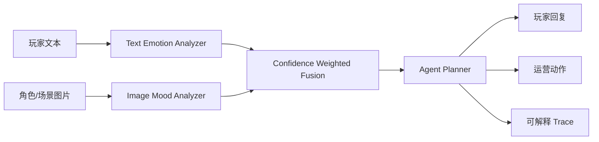

# Anime Mood Agent Studio

面向二次元手游场景的多模态情绪感知 Agent 项目。它可以同时读取玩家文本反馈和角色/场景图片，融合情绪状态，再生成角色化回复、运营风险等级、后续处理动作和可解释 agent trace。扩展版加入了玩家反馈趋势看板、RAG 知识库检索、视频抽帧情绪时间线、DeepSeek/CLIP/SigLIP 可选模型适配和 Hugging Face Spaces 友好的 Docker 部署。

这个项目定位为人工智能/游戏算法实习作品集：重点不是堆一个聊天壳，而是把“多模态情感识别、可解释融合、agent 决策、Web 部署、测试与 CI”串成一条完整工程链路。

## 应用场景

- 玩家反馈分析：识别卡池焦虑、付费不满、剧情期待、正向反馈等运营意图。
- 舆情分级：结合情绪效价、唤醒度和关键词，给出 low / medium / high 风险。
- NPC/客服回复：根据“温柔治愈、冷静策士、元气伙伴”三类人设生成不同策略的回复。
- 美术/剧情验证：上传角色立绘或活动图，评估画面氛围是否和文本反馈一致。
- 运营复盘看板：按版本和活动查看聚类、风险样本、情绪趋势。
- 规则问答：导入公告、补偿、卡池和客服口径文档，让 agent 的回复有来源。
- PV/剧情片段巡检：抽帧生成画面情绪时间线，后续可扩展音频和字幕。

## 核心能力



### 1. 文本情绪识别

- 支持中英情绪词、否定词、强度词、标点和 emoji。
- 输出 Plutchik 风格情绪分布：joy、sadness、anger、fear、trust、surprise、anticipation、disgust、neutral。
- 输出效价 valence、唤醒度 arousal、置信度 confidence 和命中证据。

### 2. 图像情绪识别

- 使用 Pillow 提取亮度、饱和度、对比度、冷暖色比例、红色占比、暗部比例、边缘密度。
- 将画面氛围映射为情绪分布，用于二次元角色立绘、活动图、战斗截图等场景。
- 不依赖云端模型，适合本地演示、课堂答辩和离线部署。

### 3. 多模态融合

- 文本和图像按置信度加权融合。
- 当文本和图像效价冲突时，会在 explanation 中提示“语义和画面氛围存在反差”。
- 输出统一情绪状态，供 agent 决策使用。

### 4. Agent 决策

Agent 不是单轮模板，而是显式执行五步：

1. `detect_intent`：识别玩家意图。
2. `assess_emotion`：读取融合情绪状态。
3. `rank_liveops_risk`：评估运营/舆情风险。
4. `select_response_style`：按人设选择回复策略。
5. `draft_action_plan`：生成玩家回复、运营动作和剧情钩子。

### 5. 扩展能力

- `CLIP / SigLIP`：`MULTIMODAL_BACKEND=clip` 或 `siglip` 时会尝试加载 Hugging Face 多模态模型；未安装重依赖或模型不可用时，自动回退到可解释的效价/唤醒度一致性判断。
- 中文情绪分类模型：`TEXT_EMOTION_BACKEND=deepseek` 或 `hybrid` 时会调用 DeepSeek OpenAI-compatible API；默认 `lexicon`，保证无密钥也能演示。
- 玩家反馈看板：内置 240 条合成样本，支持版本/活动筛选、趋势、聚类、风险样本列表。
- RAG：内置 31 条知识库 chunk，按关键词和中文二元片段检索，返回引用片段。
- 视频模态：支持 GIF/WebP 直接抽帧；MP4 等视频依赖 `imageio[ffmpeg]`。

## 模型配置

不要把密钥写入仓库。需要调用 DeepSeek 时，在本地或 Hugging Face Space Secrets 中配置：

```bash
export TEXT_EMOTION_BACKEND=hybrid
export DEEPSEEK_API_KEY="你的密钥"
export DEEPSEEK_MODEL=deepseek-v4-flash
```

需要尝试 CLIP/SigLIP 时：

```bash
export MULTIMODAL_BACKEND=clip
export MULTIMODAL_MODEL_ID=openai/clip-vit-base-patch32
```

如果部署环境内存较小，保持默认 fallback 即可；项目仍会展示图文一致性、情绪反差和可解释证据。

## 快速开始

```bash
python3 -m venv .venv
. .venv/bin/activate
pip install -e ".[dev]"
uvicorn app.main:app --host 0.0.0.0 --port 8000
```

打开浏览器访问：

```text
http://localhost:8000
```

API 文档：

```text
http://localhost:8000/docs
```

### 常见问题

如果页面提交后显示“无法连接后端服务”或浏览器原生的 `Failed to fetch`，通常是 FastAPI 服务没有启动，或页面不是通过 `http://127.0.0.1:8000` / `http://localhost:8000` 打开的。请先运行：

```bash
uvicorn app.main:app --host 0.0.0.0 --port 8000
```

再打开：

```text
http://127.0.0.1:8000
```

## Docker 部署

```bash
docker compose up --build
```

服务启动后访问：

```text
http://localhost:8000
```

## Hugging Face Spaces

推荐创建 Docker Space，并从 GitHub main 分支同步本仓库。Dockerfile 默认监听 `${PORT:-7860}`，兼容 Spaces；本地 `docker compose` 会把 `PORT` 设置为 8000。

Space Secrets 建议：

- `DEEPSEEK_API_KEY`：可选，用于 DeepSeek 情绪分类。
- `TEXT_EMOTION_BACKEND=hybrid`：可选，启用模型与词典融合。
- `MULTIMODAL_BACKEND=fallback`：默认轻量演示；想试 CLIP/SigLIP 时改为 `clip` 或 `siglip` 并准备更高资源。

## 测试

```bash
pytest
```

测试覆盖：

- 文本情绪识别和否定词处理。
- 红色高饱和图像的愤怒/高唤醒识别。
- 文本+图像融合。
- 图文语义一致性 fallback。
- `/api/health`、`/api/analyze`、`/api/dashboard`、`/api/rag`、`/api/video` 接口。

## API 示例

```bash
curl -X POST http://localhost:8000/api/analyze \
  -F "text=这次礼包说明太离谱了，感觉有点骗氪，再这样我要退坑了！" \
  -F "archetype=冷静策士"
```

返回结构包含：

- `text`：文本情绪信号。
- `image`：图像情绪信号，没有图片时为 `null`。
- `fusion`：融合后的主情绪、效价、唤醒度、置信度。
- `agent`：意图、风险等级、回复策略、玩家回复、运营动作和 trace。

更多接口：

```bash
curl http://localhost:8000/api/dashboard
curl -X POST http://localhost:8000/api/rag -F "question=维护延迟补偿怎么回复玩家？"
curl http://localhost:8000/api/model-status
```

## 项目结构

```text
.
├── app
│   ├── core
│   │   ├── agent.py
│   │   ├── config.py
│   │   ├── feedback_store.py
│   │   ├── fusion.py
│   │   ├── image_emotion.py
│   │   ├── llm_emotion.py
│   │   ├── rag.py
│   │   ├── schemas.py
│   │   ├── semantic.py
│   │   └── text_emotion.py
│   ├── data
│   │   ├── player_feedback_samples.csv
│   │   └── rag_knowledge_chunks.jsonl
│   ├── main.py
│   └── static
│       ├── assets
│       ├── app.js
│       ├── index.html
│       └── styles.css
├── tests
├── Dockerfile
├── docker-compose.yml
├── pyproject.toml
└── README.md
```
