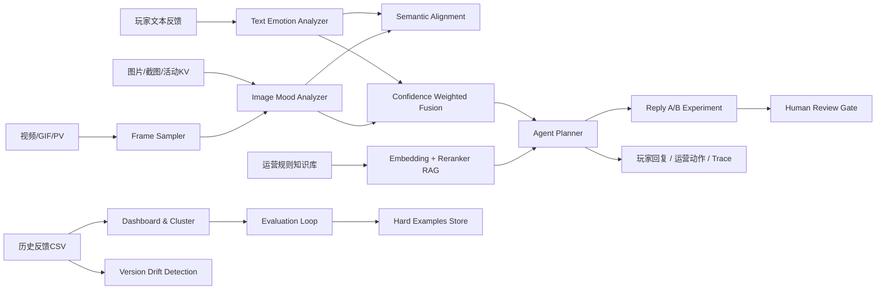

# Anime Mood Agent Studio

Anime Mood Agent Studio 是一个面向二次元手游运营、客服、剧情反馈和内容验证场景的多模态玩家反馈分析平台。项目将文本情绪识别、图像氛围分析、图文一致性判断、运营规则检索、版本漂移监控、异步批处理、客服回复实验和人工复核流程整合成一个可部署、可测试、可解释的工程样例。

本项目重点展示的是从玩家反馈到运营决策的完整技术路线：采集玩家文本、图片、视频帧和历史反馈样本；通过轻量可复现模型生成情绪与风险信号；用知识库检索补充客服和运营依据；再通过 Agent Planner 输出玩家回复、运营动作、风险解释和后续评估闭环。

## 项目定位

### 业务背景

二次元手游的运营反馈常常具有高情绪浓度、高传播速度和强版本周期性。一次维护延期、卡池说明不清、活动奖励异常或角色强度争议，都可能在社区、客服工单、TapTap、B 站评论和 Discord/QQ群等渠道形成集中反馈。单纯依靠关键词告警容易遗漏上下文，而只做大模型问答又难以解释、评估和稳定部署。

本项目将该问题拆解为几个可验证的工程任务：

- 识别玩家文本中的主情绪、效价、唤醒度和风险词。
- 从活动图、角色立绘、战斗截图、PV/GIF 抽帧中提取画面情绪信号。
- 判断图文情绪是否一致，识别“文本负向但画面正向”等反差样本。
- 基于运营规则知识库生成有引用依据的客服答复。
- 按版本、活动和渠道监控负向情绪与高风险样本漂移。
- 将 hard examples 沉淀为持续评估集，支撑后续模型迭代。
- 对客服回复做 A/B/C 变体实验，并为中高风险样本设置人工复核闸口。

### 项目目标

项目不是单一聊天页面，而是一个面向作品集和技术展示的端到端系统。核心目标如下：

- **可解释**：每个输出都带有证据、引用、trace 或指标解释。
- **可复现**：默认使用轻量 fallback 后端，不依赖外部服务即可运行测试。
- **可扩展**：预留 DeepSeek、中文情绪模型、CLIP/SigLIP、真实 embedding、reranker、队列和缓存替换点。
- **可评估**：内置合成样本、混淆矩阵、hard examples、性能基准和回归测试。
- **可部署**：支持本地 FastAPI、Docker Compose 和 Docker Space 场景。

## 总体技术架构



### 分层设计

| 层级 | 模块 | 主要职责 |
| --- | --- | --- |
| 接入层 | `app/main.py` | FastAPI 路由、表单上传、JSON API、静态页面 |
| 模态分析层 | `text_emotion.py`, `image_emotion.py`, `video_emotion.py`, `semantic.py` | 文本、图像、视频帧、图文一致性分析 |
| 融合决策层 | `fusion.py`, `agent.py`, `response_lab.py` | 多模态融合、意图识别、风险分级、回复策略、A/B 变体 |
| 知识检索层 | `rag.py` | hashing embedding 检索、lexical reranker、引用生成 |
| 运营分析层 | `feedback_store.py`, `drift.py` | 趋势看板、聚类、高风险样本、版本漂移 |
| 质量闭环层 | `evaluation.py`, `hard_examples.py` | 指标评估、混淆矩阵、hard examples 持久化 |
| 异步处理层 | `jobs.py` | 内存队列、状态查询、结果缓存、批量任务 |
| 配置层 | `config.py` | 环境变量、模型后端、缓存目录、数据路径 |

## 数据与知识库设计

### 历史反馈样本

项目内置 `240` 条合成玩家反馈样本，字段覆盖运营分析常用维度：

```text
feedback_id, created_at, game_ref, player_appellation, version, event_name,
channel, text, image_hint, text_emotion, image_emotion, fused_emotion,
intent, risk_level, need_reply, recommended_action, tags, trace
```

样本用于三类任务：

- **看板分析**：按版本、活动、渠道、意图、风险等级切分样本。
- **模型评估**：用 `text_emotion` 作为 gold label 计算准确率、macro-F1、负向召回和混淆矩阵。
- **持续学习**：将误判样本追加到 `app/data/hard_examples.jsonl`，作为后续回归集。

### 运营规则知识库

`app/data/rag_knowledge_chunks.jsonl` 内置 `31` 条知识库 chunk，覆盖：

- 维护公告与补偿规则。
- 卡池、付费、保底和礼包说明。
- 客服回复口径。
- 活动运营和奖励异常处理。
- 社区舆情升级策略。
- 剧情、角色和内容反馈准则。

每条 chunk 包含：

```json
{
  "chunk_id": "...",
  "source_doc": "...",
  "title": "...",
  "section": "...",
  "content": "...",
  "tags": ["维护", "补偿"],
  "synthetic": true
}
```

## 核心技术路线

### 1. 文本情绪识别

默认后端是可解释词典 baseline，支持中文、英文、emoji、否定词、强度词和标点特征。输出统一为 Plutchik 风格情绪向量：

```text
joy, sadness, anger, fear, trust, surprise, anticipation, disgust, neutral
```

同时输出：

- `valence`：情绪效价，范围 `[-1, 1]`。
- `arousal`：情绪唤醒度，范围 `[0, 1]`。
- `confidence`：当前识别置信度。
- `evidence`：命中词、标点、fallback 等解释。
- `detected_terms`：用于意图识别和风险判断的关键词。

可选扩展：

- `TEXT_EMOTION_BACKEND=deepseek`：通过 DeepSeek OpenAI-compatible API 获取结构化情绪结果。
- `TEXT_EMOTION_BACKEND=zh-model`：通过 `transformers` 加载中文文本分类模型。
- `TEXT_EMOTION_BACKEND=hybrid`：优先融合外部模型和词典 baseline，不可用时自动回退。

### 2. 图像情绪与视频帧分析

图像侧不默认下载重模型，而是用轻量视觉特征构造可复现 baseline：

- 亮度、饱和度、对比度。
- 暖色、冷色、红色占比。
- 暗部比例。
- 边缘密度。

这些特征会映射为统一情绪向量。例如，高红色占比和高饱和度更容易提升 `anger` 和 `arousal`，高亮暖色更容易提升 `joy` 和 `trust`。

视频模块通过抽帧复用图像分析逻辑：

- GIF/WebP 直接解析。
- MP4 等格式通过 `imageio[ffmpeg]` 读取。
- 输出每帧时间戳、图像情绪、平均效价、平均唤醒度和主导画面情绪。

### 3. 图文语义一致性

当文本和图片同时存在时，系统会比较两端信号：

- 主情绪是否一致。
- 文本和画面效价是否相反。
- 唤醒度差异是否过大。

输出字段：

- `consistency_score`：一致性得分。
- `contrast_score`：反差得分。
- `label`：`aligned`、`contrast`、`weak` 或 `unavailable`。
- `evidence`：判定依据。

生产环境可将该模块替换为 CLIP/SigLIP 图文 embedding，但默认 fallback 可保证免费 CPU 环境稳定运行。

### 4. 多模态融合

`fusion.py` 使用置信度加权融合文本和图像信号：

- 文本信号更适合捕捉具体投诉、付费争议和客服诉求。
- 图像信号更适合捕捉活动 KV、角色立绘和战斗截图的氛围。
- 当某个模态缺失时，另一个模态独立完成判断。

融合结果包括：

- 统一情绪向量。
- 主情绪。
- 效价、唤醒度、置信度。
- 权重解释。

### 5. Agent Planner

Agent Planner 将融合情绪转化为运营动作，流程显式输出 trace：

1. `detect_intent`：识别意图，如付费投诉、内容期待、焦虑、不满、正反馈。
2. `assess_emotion`：读取主情绪、效价、唤醒度。
3. `rank_liveops_risk`：将样本分为低、中、高风险。
4. `select_response_style`：按人设选择回复风格。
5. `draft_action_plan`：生成玩家回复、运营动作和剧情钩子。

内置人设：

- 温柔治愈。
- 冷静策士。
- 元气伙伴。

### 6. Embedding + Reranker RAG

RAG 模块已从关键词检索升级为两阶段检索：

1. **召回阶段**：使用 hashing embedding 将 query 和 chunk 映射到固定维度向量，计算 dense 相似度。
2. **复排阶段**：使用 lexical cross reranker 综合短语命中、标签命中、章节命中和召回分数。
3. **回答阶段**：根据 top citations 拼接带引用依据的运营/客服答复。

默认实现不依赖外部向量数据库，适合轻量部署；生产环境可替换为：

- embedding 服务：BGE、E5、text-embedding、私有中文 embedding。
- reranker：bge-reranker、cross-encoder、LLM rerank。
- 存储：FAISS、Milvus、pgvector、Elasticsearch hybrid search。

### 7. 版本漂移监控

`drift.py` 用于按版本和活动监控反馈分布变化：

- `negative_rate`：负向情绪比例变化。
- `high_risk_rate`：高/严重风险比例变化。
- `emotion_js_divergence`：情绪分布 Jensen-Shannon divergence。
- `intent_js_divergence`：意图分布 Jensen-Shannon divergence。

输出分为：

- `stable`：变化在正常波动内。
- `watch`：需要观察。
- `alert`：建议人工复核和运营动作介入。

### 8. 异步任务与缓存

`jobs.py` 提供轻量内存队列，覆盖两类长耗时入口：

- 长视频分析：`POST /api/video/jobs`
- 批量文本分析：`POST /api/batch/jobs`

设计要点：

- 任务有 `queued`、`running`、`finished`、`failed` 状态。
- 通过 `GET /api/jobs/{job_id}` 查询结果。
- 对相同输入生成 cache key，命中后直接返回缓存结果。
- 当前使用 `ThreadPoolExecutor`，生产环境可替换为 Redis Queue、Celery、Kafka 或云队列。

### 9. 持续评估与 Hard Examples

`evaluation.py` 会计算：

- exact accuracy。
- compatible accuracy。
- macro-F1。
- negative recall。
- avg confidence。
- label conflict rate。
- confusion top cells。
- hard examples。

`hard_examples.py` 将误判样本追加到 `app/data/hard_examples.jsonl`，用于后续：

- 词典补强。
- prompt 回归。
- 中文模型微调。
- RAG 策略回归测试。
- 客服回复人工复核抽样。

### 10. 客服回复实验与人工复核

`response_lab.py` 为每条反馈生成三类回复变体：

- A：共情优先，目标是降低负向情绪。
- B：行动路径优先，目标是提升工单解决率。
- C：简洁对照组，用于比较基线回复效果。

中高风险样本会生成 `review` 对象，进入人工复核流，避免高风险客服口径直接自动发送。

## API 设计

| Method | Path | 功能 |
| --- | --- | --- |
| `GET` | `/api/health` | 服务健康检查 |
| `GET` | `/api/model-status` | 当前模型、RAG、队列后端状态 |
| `GET` | `/api/archetypes` | 客服回复人设列表 |
| `GET` | `/api/examples` | 示例反馈 |
| `POST` | `/api/analyze` | 文本/图片多模态分析 |
| `GET` | `/api/dashboard` | 版本/活动趋势看板 |
| `GET` | `/api/evaluation` | 文本情绪评估报告 |
| `GET` | `/api/evaluation/hard-examples` | 持续 hard examples 集 |
| `POST` | `/api/rag` | 运营规则 RAG 问答 |
| `GET` | `/api/drift` | 版本/活动漂移检测 |
| `POST` | `/api/video` | 同步视频/GIF 抽帧分析 |
| `POST` | `/api/video/jobs` | 异步视频/GIF 抽帧分析 |
| `POST` | `/api/batch/jobs` | 异步批量文本分析 |
| `GET` | `/api/jobs/{job_id}` | 作业状态查询 |
| `POST` | `/api/reply-experiment` | 客服回复 A/B/C 实验 |

## 性能与质量指标

以下指标在本地轻量 fallback 后端下测得，适合作为可复现 baseline。测试环境使用项目默认配置、`240` 条合成反馈样本、`31` 条知识库 chunk、`15` 条已持久化 hard examples。

### 自动化测试

| 指标 | 结果 |
| --- | --- |
| 测试命令 | `python -m pytest` |
| 测试用例数 | `18` |
| 通过率 | `100%` |
| 覆盖范围 | API、文本情绪、图像情绪、多模态融合、RAG、漂移检测、异步作业、回复实验 |

### 文本情绪评估

| 指标 | 数值 | 说明 |
| --- | ---: | --- |
| dataset size | `240` | 合成玩家反馈样本数 |
| unique texts | `40` | 去重后的文本数 |
| exact accuracy | `0.204` | 严格逐行标签准确率 |
| compatible accuracy | `0.646` | 同文本多标签合并后的兼容准确率 |
| macro-F1 | `0.106` | 多类别宏平均 F1 |
| negative recall | `0.255` | 负向情绪召回率 |
| avg confidence | `0.466` | 平均置信度 |
| label conflict rate | `0.950` | 合成数据中同文本多标签冲突比例 |

解读：

- 当前默认词典 baseline 的优点是稳定、快速、可解释，适合展示和离线回归。
- `exact accuracy` 和 `macro-F1` 不高，主要原因是演示数据存在大量同文本多标签冲突；因此项目同时提供 `compatible accuracy` 和 hard examples，用于更真实地衡量可接受输出。
- 生产环境建议引入中文情绪分类模型、人工标注集和版本分桶评估，以提高负向召回和细粒度情绪区分能力。

### 运行性能

| 操作 | 中位耗时 |
| --- | ---: |
| 单条文本情绪识别 | `0.05 ms` |
| RAG 查询 | `1.90 ms` |
| Dashboard 聚合 | `0.38 ms` |
| Drift report | `0.05 ms` |
| Reply experiment | `0.07 ms` |
| 240 条文本批处理总耗时 | `10.36 ms` |
| 文本批处理吞吐 | `23165 samples/s` |

解读：

- 默认路径没有外部网络调用，适合 CPU-only 环境快速演示。
- RAG 使用内存 JSONL 和 hashing embedding，知识库规模较小时延迟很低。
- 如果切换到真实中文模型、CLIP/SigLIP 或外部 LLM，延迟会主要由模型推理和网络请求决定。

### 运营监控指标

| 指标 | 当前样本结果 |
| --- | ---: |
| 高/严重风险样本数 | `81` |
| 知识库 chunk 数 | `31` |
| seed hard examples 数 | `15` |
| 支持版本筛选 | 是 |
| 支持活动筛选 | 是 |
| 支持人工复核流 | 是 |

## 快速开始

```bash
python3 -m venv .venv
. .venv/bin/activate
pip install -e ".[dev]"
uvicorn app.main:app --host 0.0.0.0 --port 8000
```

打开：

```text
http://127.0.0.1:8000
```

API 文档：

```text
http://127.0.0.1:8000/docs
```

## 配置说明

所有模型和运行配置都通过环境变量控制。

| Variable | Default | Description |
| --- | --- | --- |
| `TEXT_EMOTION_BACKEND` | `lexicon` | `lexicon`、`deepseek`、`zh-model` 或 `hybrid` |
| `CHINESE_EMOTION_MODEL_ID` | `uer/roberta-base-finetuned-dianping-chinese` | 可选中文文本分类模型 |
| `DEEPSEEK_API_KEY` | empty | DeepSeek OpenAI-compatible API key |
| `DEEPSEEK_BASE_URL` | `https://api.deepseek.com` | DeepSeek API base URL |
| `DEEPSEEK_MODEL` | `deepseek-v4-flash` | DeepSeek model name |
| `MULTIMODAL_BACKEND` | `fallback` | `fallback`、`clip` 或 `siglip` |
| `MULTIMODAL_MODEL_ID` | `openai/clip-vit-base-patch32` | Hugging Face model id |
| `RAG_BACKEND` | `embedding-rerank` | RAG 检索链路标识 |
| `RAG_EMBEDDING_BACKEND` | `hashing` | embedding fallback 后端 |
| `RAG_RERANKER_BACKEND` | `lexical-cross` | reranker fallback 后端 |
| `ASYNC_WORKER_COUNT` | `2` | 内存异步队列 worker 数 |
| `APP_CACHE_DIR` | `app/.cache` | 模型和中间缓存目录 |
| `PORT` | `7860` in Dockerfile | 云端服务端口 |

## API 示例

文本与图片分析：

```bash
curl -X POST http://127.0.0.1:8000/api/analyze \
  -F "text=公告说法太模糊，社区都吵起来了，建议尽快补充解释。" \
  -F "archetype=冷静策士"
```

RAG 问答：

```bash
curl -X POST http://127.0.0.1:8000/api/rag \
  -F "question=维护延迟补偿怎么回复玩家？"
```

漂移检测：

```bash
curl "http://127.0.0.1:8000/api/drift?baseline_version=3.0&current_version=5.7"
```

批量异步分析：

```bash
curl -X POST http://127.0.0.1:8000/api/batch/jobs \
  -H "Content-Type: application/json" \
  -d '{"samples":["这次活动太离谱了，我要退坑了！","新角色好看，剧情也很期待。"],"archetype":"冷静策士"}'
```

客服回复实验：

```bash
curl -X POST http://127.0.0.1:8000/api/reply-experiment \
  -F "text=这次礼包说明太离谱了，感觉有点骗氪。" \
  -F "archetype=冷静策士"
```

模型状态：

```bash
curl http://127.0.0.1:8000/api/model-status
```

## Docker 部署

本地 Docker Compose：

```bash
docker compose up --build
```

访问：

```text
http://127.0.0.1:8000
```

Dockerfile 默认监听 `${PORT:-7860}`，可用于 Docker Space 或其他容器平台。

## 测试

```bash
pytest
```

测试覆盖：

- 文本情绪识别和否定词处理。
- 图像情绪特征。
- 多模态融合。
- 图文语义一致性 fallback。
- 玩家反馈看板。
- RAG 引用返回。
- 模型评估报告。
- 版本漂移报告。
- 异步批量分析作业。
- 客服回复实验和人工复核闸口。
- GIF 视频时间线。
- FastAPI 主要接口。

## 项目结构

```text
.
├── app
│   ├── core
│   │   ├── agent.py
│   │   ├── chinese_emotion_model.py
│   │   ├── config.py
│   │   ├── drift.py
│   │   ├── evaluation.py
│   │   ├── feedback_store.py
│   │   ├── fusion.py
│   │   ├── hard_examples.py
│   │   ├── image_emotion.py
│   │   ├── jobs.py
│   │   ├── llm_emotion.py
│   │   ├── rag.py
│   │   ├── response_lab.py
│   │   ├── schemas.py
│   │   ├── semantic.py
│   │   ├── text_emotion.py
│   │   └── video_emotion.py
│   ├── data
│   │   ├── hard_examples.jsonl
│   │   ├── player_feedback_samples.csv
│   │   └── rag_knowledge_chunks.jsonl
│   ├── main.py
│   └── static
│       ├── assets
│       ├── app.js
│       ├── index.html
│       └── styles.css
├── tests
├── Dockerfile
├── docker-compose.yml
├── pyproject.toml
└── README.md
```

## 生产化演进路线

### 短期

- 将词典 baseline 的 hard examples 转化为人工复核标注集。
- 针对付费争议、维护补偿、角色强度和活动奖励建立专项标签。
- 为 RAG 问答加入引用覆盖率、命中率和人工满意度评估。
- 在回复实验中记录真实点击率、追问率、工单关闭率和玩家满意度。

### 中期

- 接入真实中文情绪分类模型，并按版本、渠道和活动分桶评估。
- 将 hashing embedding 替换为真实中文 embedding。
- 引入 cross-encoder reranker，提升客服规则检索精度。
- 将内存队列替换为 Redis/RQ 或 Celery。
- 将 hard examples 纳入 CI 回归测试。

### 长期

- 接入真实客服工单、社区评论和活动运营数据。
- 构建跨版本 drift dashboard，支持自动告警。
- 引入多臂老虎机或 Bayesian A/B testing，动态选择客服回复策略。
- 增加人工复核工作台，支持审核、驳回、修改和反馈回流。
- 将图片、字幕、ASR、剧情文本和战斗行为日志纳入统一多模态分析。

## 风险与边界

- 内置数据为合成样本，不代表真实线上分布。
- 默认词典 baseline 注重可解释和速度，不适合直接替代生产模型。
- 当前性能指标来自本地轻量后端；启用真实模型或外部 API 后需要重新压测。
- 客服回复实验输出为策略建议，中高风险内容仍应经过人工复核。
- 生产环境需要补充鉴权、审计、PII 脱敏、限流、监控和数据合规流程。

## 数据说明

内置数据仅用于作品集演示、自动化测试和技术路线说明，不包含真实商业项目数据。实际使用时应替换为经过授权、脱敏并符合平台政策的数据。
