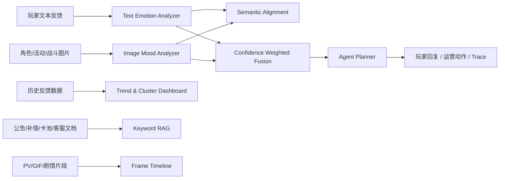

# Anime Mood Agent Studio

Anime Mood Agent Studio 是一个面向二次元手游运营、客服、剧情反馈和内容验证场景的多模态情绪感知 Agent 演示项目。项目把玩家文本、角色/场景图片、历史反馈样本、运营规则文档和视频帧分析串成一个可部署、可评估、可解释的完整工程链路。

项目目标不是制作一个单纯聊天页面，而是展示游戏 AI 应用岗位常见的端到端能力：

- 多模态情绪识别：文本、图像、图文一致性、视频抽帧时间线。
- 可解释 Agent 决策：意图识别、风险分级、玩家回复、运营动作和 trace。
- LiveOps 数据看板：版本/活动维度聚类、趋势、风险样本列表。
- RAG 规则问答：维护补偿、卡池说明、活动规则、客服口径和舆情处理。
- 模型质量闭环：用合成标注数据输出 accuracy、macro-F1、负向情绪召回、混淆矩阵和 hard examples。
- 云端部署：兼容 Hugging Face Spaces Docker Space，也支持本地 Docker Compose。

## Feature Overview



## Core Modules

### 1. Text Emotion Analyzer

默认文本模型是可解释词典 baseline，支持：

- 中英情绪词。
- 否定词、强度词、标点和 emoji。
- Plutchik 风格情绪分布：`joy`、`sadness`、`anger`、`fear`、`trust`、`surprise`、`anticipation`、`disgust`、`neutral`。
- `valence`、`arousal`、`confidence` 和命中证据。

可选 DeepSeek API 适配：

- `TEXT_EMOTION_BACKEND=deepseek`：使用 DeepSeek 返回的结构化情绪分类。
- `TEXT_EMOTION_BACKEND=hybrid`：融合 DeepSeek 输出和词典 baseline。
- 未配置 API key 或接口不可用时自动回退到 baseline。

### 2. Image Mood Analyzer

图像侧默认使用轻量、可复现的视觉特征：

- 亮度、饱和度、对比度。
- 冷暖色比例、红色占比、暗部比例。
- 边缘密度。

这些特征会映射到统一情绪向量，用于角色立绘、活动 KV、战斗截图和剧情 CG 的氛围判断。

### 3. 图文语义一致性

`/api/analyze` 在同时提供文本和图片时会返回 `semantic` 字段：

- `consistency_score`：图文情绪一致性。
- `contrast_score`：文本语义和画面氛围反差。
- `label`：`aligned`、`contrast`、`weak`。
- `evidence`：可解释证据。

可选 CLIP/SigLIP：

- `MULTIMODAL_BACKEND=clip`
- `MULTIMODAL_BACKEND=siglip`
- `MULTIMODAL_MODEL_ID=openai/clip-vit-base-patch32`

当部署环境没有安装重依赖或模型不可用时，系统使用效价/唤醒度/主情绪差异作为 fallback。

### 4. Agent Planner

Agent 决策流程显式输出 trace：

1. `detect_intent`：识别玩家意图。
2. `assess_emotion`：读取融合情绪状态。
3. `rank_liveops_risk`：评估运营/舆情风险。
4. `select_response_style`：按人设选择回复策略。
5. `draft_action_plan`：生成玩家回复、运营动作和剧情钩子。

内置人设：

- 温柔治愈
- 冷静策士
- 元气伙伴

### 5. Player Feedback Dashboard

项目内置 `240` 条合成玩家反馈样本，字段包括：

`feedback_id, created_at, game_ref, version, event_name, channel, text, image_hint, text_emotion, image_emotion, fused_emotion, intent, risk_level, recommended_action, tags, trace`

看板能力：

- 总样本数、风险样本数、主要情绪、聚类数。
- 按版本和活动筛选。
- 按日期展示反馈趋势。
- 按意图聚类展示主要主题。
- 列出高风险/严重风险样本和推荐动作。

### 6. RAG Knowledge Base

项目内置 `31` 条知识库 chunk，来源于演示版运营规则文档：

- 维护与补偿规则。
- 卡池与付费规则。
- 客服回复口径。
- 活动运营规则。
- 社区舆情处理。
- 剧情和角色反馈准则。

当前 RAG 使用关键词和中文二元片段检索，返回答案和引用片段。该实现轻量、可复现，适合本地和免费云端环境演示。后续可替换为向量数据库和 embedding reranker。

### 7. Video Timeline

`/api/video` 支持 GIF/WebP 直接抽帧，也支持通过 `imageio[ffmpeg]` 处理 MP4 等视频格式。输出：

- 帧序号。
- 时间戳。
- 每帧图像情绪信号。
- 平均效价和唤醒度。
- 视频主导画面情绪。

该模块预留了音频、字幕、ASR 和剧情台词情绪融合的扩展路径。

### 8. Model Evaluation

`/api/evaluation` 使用内置反馈样本中的 `text_emotion` 作为 gold label，对当前文本情绪后端进行可复现评估：

- `accuracy`
- `compatible_accuracy`
- `macro_f1`
- `negative_recall`
- `avg_confidence`
- `label_conflict_rate`
- confusion top cells
- hard examples
- optimization recommendations

其中 `exact_accuracy` 使用逐行标注做严格比较；`compatible_accuracy` 会把相同文本在合成数据中出现的多个可接受标签合并后再评估，用于识别演示数据中的标签噪声。该模块用于形成模型质量闭环：每次扩展词典、prompt、中文分类模型或融合策略后，都能直接复测指标和失败样本。

## Quick Start

```bash
python3 -m venv .venv
. .venv/bin/activate
pip install -e ".[dev]"
uvicorn app.main:app --host 0.0.0.0 --port 8000
```

打开：

```text
http://127.0.0.1:8000
```

API 文档：

```text
http://127.0.0.1:8000/docs
```

## Configuration

所有模型和运行配置都通过环境变量控制。

| Variable | Default | Description |
| --- | --- | --- |
| `TEXT_EMOTION_BACKEND` | `lexicon` | `lexicon`、`deepseek` 或 `hybrid` |
| `DEEPSEEK_API_KEY` | empty | DeepSeek OpenAI-compatible API key |
| `DEEPSEEK_BASE_URL` | `https://api.deepseek.com` | DeepSeek API base URL |
| `DEEPSEEK_MODEL` | `deepseek-v4-flash` | DeepSeek model name |
| `MULTIMODAL_BACKEND` | `fallback` | `fallback`、`clip` 或 `siglip` |
| `MULTIMODAL_MODEL_ID` | `openai/clip-vit-base-patch32` | Hugging Face model id |
| `APP_CACHE_DIR` | `app/.cache` | 模型和中间缓存目录 |
| `PORT` | `7860` in Dockerfile | 云端服务端口 |

示例：

```bash
export TEXT_EMOTION_BACKEND=hybrid
export DEEPSEEK_API_KEY="..."
export MULTIMODAL_BACKEND=fallback
uvicorn app.main:app --host 0.0.0.0 --port 8000
```

## Docker

本地 Docker Compose：

```bash
docker compose up --build
```

访问：

```text
http://127.0.0.1:8000
```

Dockerfile 默认监听 `${PORT:-7860}`，用于兼容 Hugging Face Spaces。`docker-compose.yml` 在本地将 `PORT` 设置为 `8000`。

## Hugging Face Spaces

推荐创建 Docker Space，并把本仓库推送到 Space repo。

Space 建议配置：

- SDK：Docker
- Hardware：CPU Basic
- Visibility：Public
- Secret：`DEEPSEEK_API_KEY`，可选
- Variable：`TEXT_EMOTION_BACKEND=lexicon` 或 `hybrid`
- Variable：`MULTIMODAL_BACKEND=fallback`

免费 CPU 环境建议保持 `fallback`，保证应用稳定启动。需要展示 CLIP/SigLIP 时可改为 `clip` 或 `siglip`，同时准备更高内存和较长冷启动时间。

## API Examples

文本分析：

```bash
curl -X POST http://127.0.0.1:8000/api/analyze \
  -F "text=公告说法太模糊，社区都吵起来了，建议尽快补充解释。" \
  -F "archetype=冷静策士"
```

趋势看板：

```bash
curl http://127.0.0.1:8000/api/dashboard
curl "http://127.0.0.1:8000/api/dashboard?version=5.7"
```

RAG：

```bash
curl -X POST http://127.0.0.1:8000/api/rag \
  -F "question=维护延迟补偿怎么回复玩家？"
```

模型评估：

```bash
curl http://127.0.0.1:8000/api/evaluation
```

模型状态：

```bash
curl http://127.0.0.1:8000/api/model-status
```

## Testing

```bash
pytest
```

测试覆盖：

- 文本情绪识别和否定词处理。
- 图像情绪特征。
- 多模态融合。
- 图文语义一致性 fallback。
- 玩家反馈看板。
- RAG 引用返回。
- 模型评估报告。
- GIF 视频时间线。
- FastAPI 主要接口。

## Project Structure

```text
.
├── app
│   ├── core
│   │   ├── agent.py
│   │   ├── config.py
│   │   ├── evaluation.py
│   │   ├── feedback_store.py
│   │   ├── fusion.py
│   │   ├── image_emotion.py
│   │   ├── llm_emotion.py
│   │   ├── rag.py
│   │   ├── schemas.py
│   │   ├── semantic.py
│   │   ├── text_emotion.py
│   │   └── video_emotion.py
│   ├── data
│   │   ├── player_feedback_samples.csv
│   │   └── rag_knowledge_chunks.jsonl
│   ├── main.py
│   └── static
│       ├── assets
│       ├── app.js
│       ├── index.html
│       └── styles.css
├── tests
├── Dockerfile
├── docker-compose.yml
├── pyproject.toml
└── README.md
```

## Dataset Notes

内置数据为合成样本，用于作品集演示、RAG 检索和自动化测试。数据结构参考二次元手游常见的维护公告、活动规则、卡池说明、客服处理和社区反馈类型，不包含真实商业项目数据。

实际生产环境中，应替换为经授权采集、脱敏处理并符合平台政策的数据。

## Extension Roadmap

可继续扩展的方向：

- 使用 embedding + reranker 替换关键词 RAG。
- 引入真实中文情绪分类模型并保留 fallback。
- 增加活动版本级别的 drift detection。
- 接入队列和缓存，异步处理长视频和批量样本。
- 将 hard examples 沉淀为持续评估集。
- 为客服回复加入 A/B 实验指标和人工复核流。
